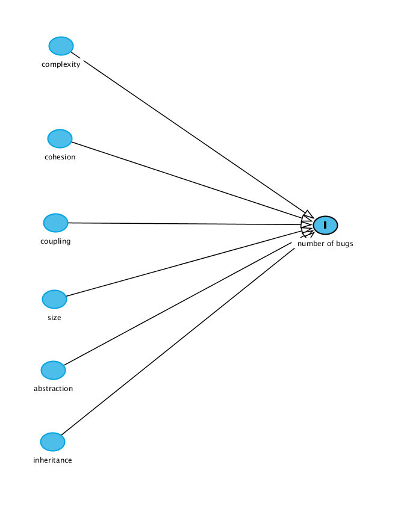

# BayesianAnalysis
## Background
Internal attributes of software include complexity, coupling, cohesion, size, level of inheritance and level of abstraction in the source code. In this project, we use bayesian data analysis to analyse the relationship between software bugs in the software and internal attributes of software. In this regard, we consider the above mentioned six internal attributes in order to develop a bayesian model that explains their relationship with software bugs.

Internal attributes of software are often measured using object oriented source code metrics proposed by Chidamber and Kemerer, Mccabe etc. Goel et al.[1] give an overview on these source code metrics. We utilise the dataset made available [here](https://figshare.com/articles/dataset/Software_Defect_Prediction_Dataset/13536506) which reports 20 source code metrics along with the number of bugs found for several open source systems.

In order to avoid issues of multicollinearity in our model, we only select one static source code metric for each individual internal attribute considered.
The directed acyclic graph, DAG, is depicted in the following figure. Later, we also discuss our choice of selecting a source code metric that corresponds to the internal attributes of interest.

  

## Selecting priors

## References
[1] B. M. Goel and P. K. Bhatia, ‘An Overview of Various Object Oriented Metrics’, International Journal of Information Technology, vol. 2, no. 1, p. 11.
