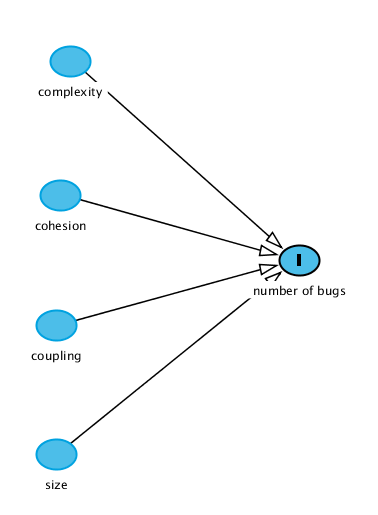
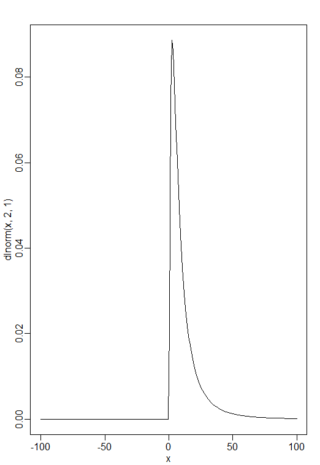
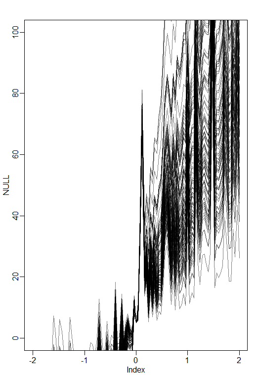
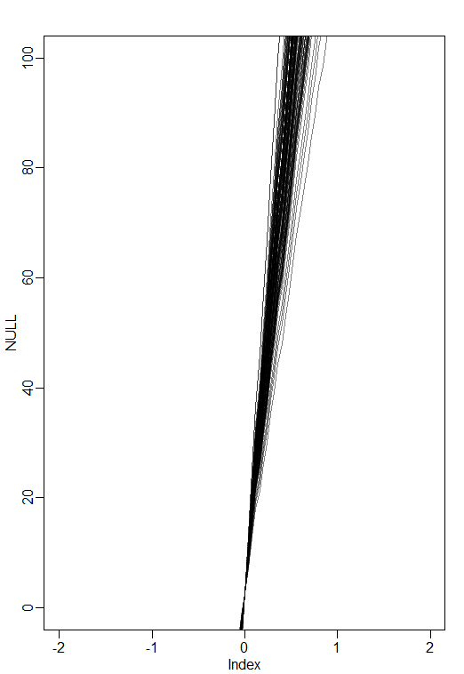

# Bayesian analysis of software bugs using source code metrics

### Background
Internal attributes of software include complexity, coupling, cohesion, and size in the source code. In this project, we use bayesian data analysis to analyse the relationship between software bugs in the software and internal attributes of software across multiple software projects. In this regard, we consider the above mentioned four internal attributes in order to develop a bayesian model that explains their relationship with software bugs across 11 open source projects.

Internal attributes of software are often measured using object oriented source code metrics proposed by Chidamber and Kemerer, Mccabe etc. Goel et al.[1] gives a brief overview on these source code metrics. We utilise the dataset made available [here](https://figshare.com/articles/dataset/Software_Defect_Prediction_Dataset/13536506) which reports 20 source code metrics along with the number of bugs found for several open source systems.

### Designing the directed acyclic graph
The directed acyclic graph, DAG, is depicted in the following figure. According to our understanding of static source code measurement, internal attributes do not influence each other. This may be better illustrated with an example. A piece of code which may be highly complex but has low coupling with other pieces of code. Also, small lenght of source code can also be complex depending on the kind of functionality implemented while very long length of source code may contain less complexity. The bugs introduced due to carelessness or lack of knowledge of the developer are not considered and is an unobserved variable in our analysis.     

<p align="center">
  
</p>

### Selecting source code metrics
In order to avoid issues of multicollinearity in our model, we only select one static source code metric to represent individual internal attribute considered. The following set of source code metrics have been extracted in the dataset considered. 

| Internal attribute | Extracted metrics             |
|--------------------|-------------------------------|
| Complexity         | WMC, **RFC**, AMC, MAX-CC, AVG-CC | 
| Coupling           | **CBO**, CA, CE, IC               |
| Cohesion           | LCOM, **LCOM3**, CAM, CBM         |
| Size               | **NPM**, LOC,                     |

The model created selects a single source code metric for each internal attribute. Based on a previous study [2], that classified source code metrics according to the strength of relationship between them and software reliability. Presence of software bugs effects reliability. Based on the reported strength of the relation, we selected a combination of source code metrics to describe our model. Their descriptions are provided in the following table.

| Source code metric | Description             |
|--------------------|-------------------------|
| RFC                | The response for a class is the count of the set of all methods that can be invoked in response to a message to an object of the class of by some method in the class                         |   
| CBO                | The metric is a count of the number of other classes to which the currenct class is coupled, via non-inheritance-related couples. Two classes are coupled when the methods of one class use methods or attributes of another class.                        |
| LCOM3              | A variant of LCOM, which is defined as the cohesion of a class is characterized by how closely the local methods are related to the local attributes.                        | 
| NPM                | Number of public methods in a class  | 

### Selecting probability distribution
Since software bugs can take on positive values and the upper bound of the present software bugs in a module is unknown, we assume counting of software bugs can be represented using a poisson distribution. Another good option can be for gamma-poisson distribution. Though, as the difference between mean and variance of the outcome variable (bugs in our case) is not huge, we can stick with poisson. Also, since the source code metrics only take positive values for a given software module, we chose log-normal as the distribution for the priors of the source code metrics.  

```
bugs ~ possion(lamda)
rfc ~ log-normal(mu, sigma)
npm ~ log-normal(mu, sigma)
cbo ~ log-normal(mu, sigma)
lcom3 ~ log-normal(mu, sigma)
```

### Load and clean data  
After extracting data from the stored file, we separate the variables of interest in a separate data frame. We also remove any rows with incomplete data using **complete.cases** command. We chose not to standardise the data for the source code metrics. The reason for this choice is that zero value for any source code metric is in itself meaningful.   

```
#read data from file
data <- read_excel("..../PSOWEdata2.xlsx", sheet = "combined", n_max = 3738)
#load the read data in a data frame
d <- data.frame(data$wmc, data$dit, data$noc, data$cbo, data$rfc, 
                data$ca, data$ce, data$npm, data$lcom3, 
                data$loc, data$dam, data$moa,  data$mfa, 
                data$cam, data$ic, data$cbm, data$amc, 
                data$avg_cc, data$bug, data$projectcode)

#remove any rows with incomplete data
d <- d[complete.cases(d),]

#load project id as a categorical variable
p <- as.factor(d$data.projectcode)

rfc <- d$data.rfc
npm <- d$data.npm
cbo <- d$data.cbo
lcom3 <- d$data.lcom3
bugs <- d$data.bug

#form a clean dataframe to be used in the model
dd <- data.frame(p, rfc, npm, cbo, lcom3, bugs)
dd <- dd[complete.cases(dd),]


#view the data frame to note the data types assigned 
str(dd)
'data.frame':	3737 obs. of  6 variables:
 $ p    : Factor w/ 11 levels "1","2","3","4",..: 1 1 1 1 1 1 1 1 1 1 ...
 $ rfc  : num  288 109 210 73 169 152 150 60 157 135 ...
 $ npm  : num  103 20 28 10 35 13 24 8 27 40 ...
 $ cbo  : num  365 12 31 13 51 24 25 6 25 39 ...
 $ lcom3: num  0.975 0.892 0.877 0.82 0.849 ...
 $ bugs : num  10 8 8 7 6 6 6 6 5 5 ...
```
### Selecting reasonable priors

Next, we start with very broad priors for our predictor variables, i.e, rfc, npm, cbo, lcom3 and project id. Our initial guess is based on our understanding of what average values we expect for these predictors to take. 

```
a <- rlnorm(1e4, 4, 10)
mean(a)
[1] 3.911037e+14
```
Based on the assumption that source code metrics usually do not have such high mean values, we try a lower value for both mean and standard deviation, which looks a bit reasonable. We also plot these priors to see what they look like.

```
a<- rlnorm(1e4, 2, 1)
mean(a)
[1] 12.2985
curve(dlnorm(x,2,1), from = -100, to=100, n=200)
```
<p align="center">
  
</p>

In order to see what our choice of prior looks like when we plot them together for all our predictor variable, we choose 100 samples from log-normal distribution and plot them together.

```
set.seed(10)
N <- 100
a <- rlnorm( N , 2 , 1 )
b <- rlnorm( N , 2 , 1 )
c <- rlnorm( N , 2 , 1 )
d <- rlnorm( N , 2 , 1 )
e <- rlnorm( N , 2 , 1 )
plot( NULL , xlim=c(-2,2) , ylim=c(0,100) )
for ( i in 1:N ) curve( a + b[i]*x + c[i]*x + d[i]*x + e[i]*x , add=TRUE , col=grau() )
```
<p align="center">
  
</p>

This can be improved upon further but experimenting with the standard deviation and mean. We settled for the following. The different choices of mean for each predictor is based on the assumption that the means of the source code metrics will be different and usually size metrics have larger values and thus a larger mean.

```
set.seed(10)
N <- 100
a <- rlnorm( N , 1 , 0.2 )
b <- rlnorm( N , 3 , 0.2 )
c <- rlnorm( N , 5 , 0.2 )
d <- rlnorm( N , 2 , 0.2 )
e <- rlnorm( N , 1 , 0.2 )
plot( NULL , xlim=c(-2,2) , ylim=c(0,100) )
for ( i in 1:N ) curve( a + b[i]*x + c[i]*x + d[i]*x + e[i]*x , add=TRUE , col=grau() )
```

<p align="center">
  
</p>
As these priors are in a narrow range , we can move to implementing our model using the ULAM function.

### Model description
The following model is designed using the priors shown in the previous section.

```
m7<- ulam(
  alist(bugs ~ dpois(mu),
        mu <- a[p] + b*rfc + c*npm  + d*cbo + e*lcom3,
        a[p] ~ dlnorm(1,0.2),
        b ~ dlnorm(3,0.2),
        c ~ dlnorm(5,0.2),
        d ~ dlnorm(2,0.2),
        e ~ dlnorm(1,0.2)
        ),data=dd, chains=4, log_lik=TRUE
)
precis(m7,depth=2)
```
### Posterior results
The precis of the model is as follows, along with plot of the precis values. We note that the Rhat4 value has conveged to 1 and ULAM call has extracted many different samples as n_eff looks to be normal.

```
Enter the precis summary
```

Lets plot the priors of the ULAM function.

Also the traceoplot of the model is depicted below. It shows that the values explored by the ULAM are in a narrow range.


The counterfactual plot of the model is as follows. This shows that while the model has picked up the general trend of the data, it only loosely fits the data. Based on the model, we can say that the source code metrics can be used to identify the likelihood of bugs in a software.


## References
[1] B. M. Goel and P. K. Bhatia, ‘An Overview of Various Object Oriented Metrics’, International Journal of Information Technology, vol. 2, no. 1, p. 11.
[2] Iftikhar, U., Ali, N.B., Börstler, J., Usman, M.: A tertiary study on links between source code metrics and external quality attributes. Information and Software Technology -, (Submitted)
